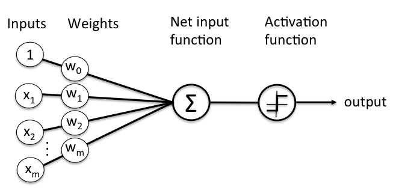
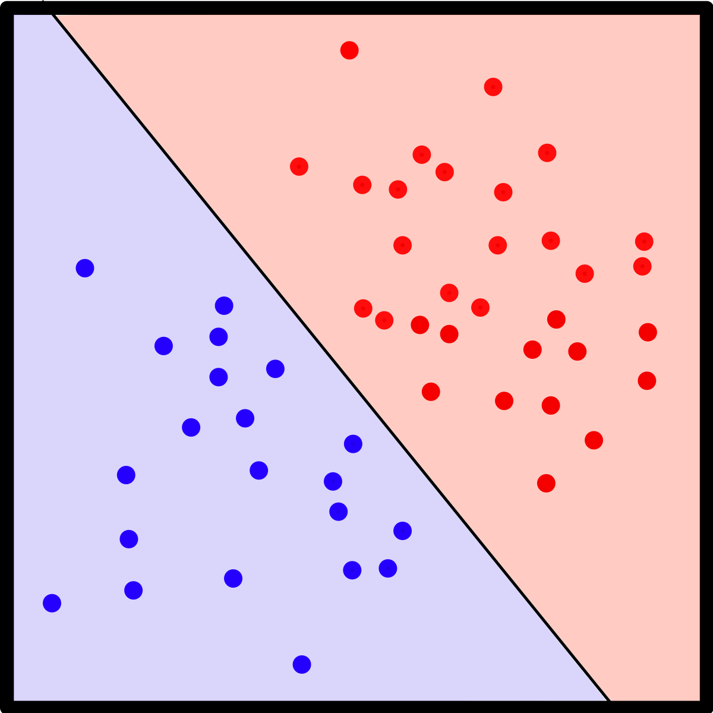
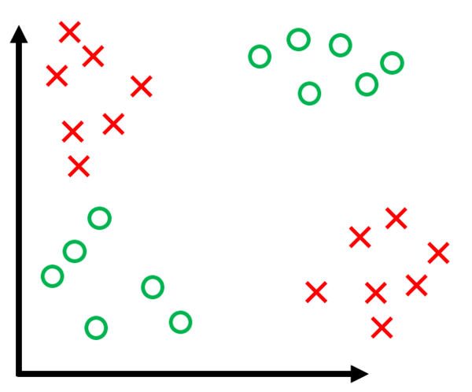

# Perceptron
## Introdução

O Perceptron é um algoritmo de classificação **linear**. Isto é: a sua predição é feita a partir da **combinação linear** do **vetor de características** (feature vector, em inglês).

Seu funcionamento é inspirado no funcionamento de um neurônio biológico, motivo pelo qual também é chamado de **neurônio de McCulloch-Pitts**, em homenagem a seus idealizadores. A primeira implementação foi feita em 1957, por Frank Rosenblatt.

A predição é feita ao combinar as entradas, ponderadas por um peso, adicionar um viés e passar o resultado por uma **função de ativação**. É importante notar que o perceptron só conseguirá uma predição que se adeque completamente ao conjunto de treinamento quando este for **linearmente separável**.

## Conjuntos linearmente separáveis

Um conjunto de dados é **linearmente separável** se existe um hiperplano que separa as classes de pontos. 

Um hiperplano é definido por equações lineares. Ou seja, supondo um espaço de n dimenões, podemos definir um hiperplano por:

$$a_1 x_1 + a_2 x_2 + \ldots + a_n x_n = - b $$
 
Ou, em formato vetorial:

$$w \cdot x = -b $$

Em um espaço bidimensional, um hiperplano é uma linha. Em um espaço tridimensional, um hiperplano é um plano.

A imagem abaixo representa um conjunto de dados **linearmente separável**:

A imagem abaixo representa um conjunto de dados **não linearmente separável**:

## Algoritmo

Primeiro, precisamos definir algumas variáveis:

* x: vetor de características
* w: vetor de pesos (ou parâmetros)

Ao invés de definirmos o viés como uma variável, iremos incluí-lo no vetor de pesos. Para isso, iremos definir $$x_0 = 1$$. Isto é: se os pontos a serem classificados estão em um espaço de n-dimensões, os vetores $$x$$ e $$w$$  terão $$n+1$$ dimensões. 

Portanto, iremos nos referir aos valores nos vetores $$x$$ e $$w$$ a partir de 0. Com isso:

$$x = \begin{bmatrix} x_0\\   x_1\\   \vdots\\   x_{n-1}\\  x_n\\   \end{bmatrix}     =     \begin{bmatrix}      1\\     x_1\\     \vdots\\     x_{n-1}\\     x_n\\     \end{bmatrix} $$

$$w = \begin{bmatrix}     w_0\\     w_1\\     \vdots\\     w_ {n-1}\\     w_n\\     \end{bmatrix}     $$

* y: classe do ponto. Para esse algoritmo, definiremos y como $$1$$ ou $$-1$$.

Iremos definir a nossa função de ativação como a função $$sign$$, definida da seguinte forma:

$$sign(k) = \begin{cases} +1, \text{ se } k \geq 0\\ -1, \text{ se } k < 0 \end{cases} $$

Iremos definir a predição do nosso modelo como $$h(x)$$. Isto é:

$$h(x) = sign(w^T x)$$

Por último, iremos nos referir ao vetor de pesos no passo $$t$$ como $$w(t)$$. Similarmente, o ponto escolhido no passo $$t$$ será referido como $$(x(t), y(t))$$. Iremos nos referir ao número total de passos como $$T$$.

O algoritmo de treinamento é o seguinte:

1. Inicialize o vetor de pesos $$w(0)$$.
2. Defina $$ t = 0 $$.
3. Enquanto houver um ponto $$(x(t), y(t))$$ classificado incorretamente, faça:
    1.  Defina $$w(t + 1) = w(t) + y(t) x(t)$$
    2.  Incremente $$t$$.
4. Retorne $$w(T)$$.

Note que esse algoritmo está abstraindo algumas coisas: para encontrar um ponto incorretamente classificado, é necessário recalcular $$h(x)$$ para todos os pontos, até encontrar um ponto incorretamente classificado.

## Convergência

O algoritmo tem **convergência garantida para conjuntos linearmente separáveis**. Para os demais conjuntos, não é garantido que a execução irá terminar e, portanto, é interessante guardar o melhor vetor de pesos até aquele momento. Esse algoritmo é chamado de **pocket algorithm**. 

## Pocket algorithm
Iremos definir $$w^*$$ como o melhor vetor de pesos até o momento. Defina $$e(w)$$ como o número de pontos incorretamente classificados pelo vetor de pesos $$w$$. Nesse algoritmo, o número de passos $$T$$ é dado.

Segue o algoritmo:

1. Inicialize o vetor de pesos $$w(0)$$.
2. Defina $$w^* = w(0)$$.
3. Para $$t=1, \cdots, T$$:
    1. Se existe ponto $$(x(t), y(t))$$ incorretamente classificado, faça: 
        1. Defina $$w(t+1) = w(t) + y(t) x(t)$$
        2. Se $$e(w^*) > e(w(t+1))$$, faça:
            1. Defina $$w^* = w(t+1)$$
    2. Se não, encerre o laço.
4. Retorne $$w^*$$.

## Recursos úteis
- [Perceptron - Wikipedia](https://en.wikipedia.org/wiki/Perceptron)
- [The Linear Model I - Learning From Data](https://www.youtube.com/watch?v=FIbVs5GbBlQ&list=PLnIDYuXHkit4LcWjDe0EwlE57WiGlBs08&index=3)
- [Linear Separability of Data](https://kmoy1.github.io/ML_Book/chapters/Ch2/linearseparability.html)
