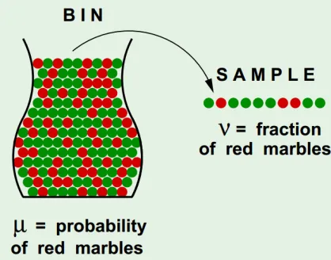

# O Aprendizado é Possível?

Pode parecer uma pergunta boba, visto que nós, como humanos, somos uma evidência verdadeira de que o aprendizado, de fato, é possível. Entretanto, utilizaremos modelos numéricos para modelar o mundo a nossa volta, e para garantir que possamos realmente criar modelos capazes de aprender assim como nós humanos precisamos de uma garantia matemática que chegaremos a uma solução satisfatória dadas certas condições. Prepare-se para um passeio no mundo da probabilidade!

Para aprender qualquer coisa, seja reconhecer um cachorro, andar ou até mesmo matemática básica precisamos enteder a natureza daquilo que estamos aprendendo à partir de **amostras** que exemplificam aquilo a ser aprendido. Por exemplo, para aprender o que é um cachorro, provavelmente lhe disseram o que é um cachorro mostrando fotos ou exemplos reais do que, de fato, é um cachorro. Como outro exemplo, o processo de aprender a caminhar é análogo: tentamos andar múltiplas vezes com diversas falhas, porém ao mesmo tempo coletamos evidências sobre o que devemos ou não fazer para mantermos nosso equilíbrio de pé até aprendermos a caminhar. Portanto, precisamos de um **conjunto de dados** que **dá informações sobre a natureza do problema que desejamos resolver**.

### O Problema da Jarra de Bolinhas 

Vamos trabalhar com o seguinte exemplo concreto: Considere uma jarra cheia de bolinhas, com cores verdes e vermelhas. Você não é capaz de de ver o conteúdo total de bolinhas da jarra, mas pode pegar uma pequena amostra de tamanho $$N$$. Ilustramos o exemplo com a imagem abaixo:

Nesse sentido, podemos nos fazer a seguinte pergunta: a fração de bolinhas que pegamos da jarra representa a distribuição de bolinhas dentro da jarra? Temos duas possíveis respostas para essa pergunta:

- Não. Em uma situação onde a jarra tivesse 1.000.000 de bolinhas verdes e 10 vermelhas e acontecer o infortúnio de pegarmos o conjunto de 10 bolinhas vermelhas conseguiríamos informação que não corresponde com a distribuição real de bolinhas na jarra, já que seríamos induzidos a achar que na jarra há mais bolas vermelhas do que verdes. 

- Sim. Dada uma quantidade grande de bolinhas coletadas da jarra, tendemos a cada vez nos aproximar mais da distribuição original da jarra, em média. 

*Machine Learning* parte do pressuposto que podemos estimar o comportamento de problemas com amostras grandes o suficiente, utilizando embasamento probabilístico. Considerando $$\mu$$ probabilidade real que uma bolinha vermelha seja retirada da jarra e $$\nu$$ a fração de bolinhas vermelhas retiradas à partir da amostra de tamanho $$N$$, a seguinte desigualdade é verdadeira, para $$\epsilon \geq 0$$:

$$\text{I\kern-0.15em P}(|\nu - \mu| > \epsilon) \leq e^{- \epsilon^2N}.$$

Tal desigualdade é chamada de **Desigualdade de Hoeffding** e é basicamente um resultado derivado da "Lei dos Grandes Números". Essa expressão pode parecer assustadora inicialmente, mas vamos por partes:

- $$|\nu - \mu|$$ representa o erro de nossa expressão, visto que estamos vendo a diferença da distribuição real dos dados em relação à distribuição calculada usando nossa amostra. Quando denotamos "$$\text{I\kern-0.15em P}(|\nu - \mu| > \epsilon)$$" queremos encontrar a probabilidade que nosso erro será no mínimo $$\epsilon$$.

- Para o lado direito de desigualdade, temos uma função exponencial com expoente negativo, que é um ótimo limitante superior por tender a ser muito pequeno. À medida que o valor de $$N$$ cresce, o valor da expressão $$e^{- \epsilon^2N}$$ tende a ficar cada vez menor. É importante se atentar à constante $$\epsilon^2$$ no expoente, que significa que quanto menor for $$\epsilon$$ mais "penalizado" será nosso limitante superior, ou seja, temos mais chances de possuirmos nosso erro maior que o limiar $$\epsilon$$ definido.

### Formalizando o Aprendizado

Com o exemplo anterior, podemos finalmente começar a modelar matematicamente um problema de aprendizado qualquer. 

Digamos que desejamos modelar um problema à partir de uma função que consiga o menor erro possível. Essa função será dada por $$f : X \longrightarrow Y$$ para os conjuntos de valores numéricos $$X$$ (entrada para nossa função) e $$Y$$ (variável prevista do problema). Nesse caso, desejamos encontrar uma função estimadora $$h : X \longrightarrow Y$$ mais próximo possível de $f$. Podemos assumir que cada bolinha presente na jarra de bolinhas representa um valor possível $$x \in X$$ e definiremos a cor da bolinha como verde quando $$f(x) = h(x)$$ e vermelha caso o contrário. Chamamos $$f$$ de **função alvo** e $$h$$ de **função de hipótese**. Defniremos também as métricas de erro $$E_{\text{in}}$$ e $$E_{\text{out}}$$, onde $$E_{\text{in}}(h)$$ representa o erro de nosso aproximador $$h$$ dentro da "amostra de bolinhas retiradas" e $$E_{\text{out}}(h)$$ sendo o erro verdadeiro de nosso estimador dentro da distribuição real do problema. Com isso, podemos reescrever a Desigualdade de Hoeffding da seguinte forma:

$$\text{I\kern-0.15em P}(|E_{\text{out}}(h) - E_{\text{in}}(h)| > \epsilon) \leq e^{- \epsilon^2N}.$$

Significando que, à medida que a quantidade de amostras que possuimos aumenta, maior será a chance de nosso erro na amostra ser igual ao erro encontrada na distribuição real.

Note que, em nenhum momento afirmamos com certeza que haverá potencial de aprendizado de uma distribuição à partir de uma pequena amostra da mesma. Porém, de forma probabilistica, pudemos mostrar que cada vez mais temos poder descritivo com grande quantidade de dados. Sendo assim, o aprendizado é, de fato, possível! (A não ser que você não tenha dados ou seja muuuito azarado)

Na próxima sessão do capítulo, veremos diferentes tipos de aprendizado e possíveis aplicações para cada um deles. Nos vemos na próxima!

## Recursos Úteis

- [Learning From Data - Aula 1](https://youtu.be/mbyG85GZ0PI?si=X1mzg9cyac_UE2fP) (Para os falantes em inglês)