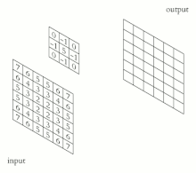
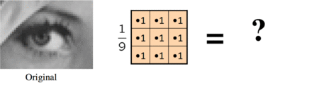
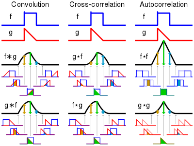

# Camada convolucional

## Convoluções

Primeiramente, é importante definirmos convolução. Dados dois sinais uni-dimensionais discretos $$f$$ e $$g$$, sua convolução $$f * g$$ é calculada como:

$$
(f*g)[n]=\sum_{i=-\infty}^{+\infty}f[n]g[n-i] 
$$

Dados dois sinais bi-dimensionais discretos $$f$$ e $$g$$, sua convolução $$f * g$$ é calculada como:

$$
(f*g)[m][n]=\sum_{i=-\infty}^{+\infty}\sum_{j=-\infty}^{+\infty}f[m][n]  \cdot g[m-i][n-j]
$$

No caso prático, temos que o sinal $$g$$ é dado por uma janela (ou núcleo), comumente quadrada e de tamanho ímpar. Com isso, podemos abstrair a convolução como a multiplicação de uma janela deslizante. A animação abaixo ilustra esse processo. Importante notar que a janela precisa ser espelhada na convolução, apesar de não ilustrado na animação. 

Esse processo pode ser utilizado para a aplicação de diferentes filtros nas imagens. Por exemplo: utilizando uma janela $$3$$ x $$3$$ com todos pesos iguais a $$\frac{1}{9}$$, podemos gerar um filtro que borra a imagem (média móvel). Abaixo, temos um exemplo da aplicação desse filtro:

Também é importante notar que a convolução é comumente implementada no contexto de machine learning como "cross-corelation", uma operação muito parecida, mas sem o espelhamento da janela. Note que, como os pesos são aprendidos em nosso caso, não há diferença alguma. Portanto, em nosso contexto convolução e cross-corelation são sinônimos.

Uma pergunta pertinente que pode ser feita é o que acontece nas bordas da imagem. Quando a janela está sendo deslizada por elas, o que acontecem com os pixels faltantes? O processo de completar esses pixels é chamado de padding. O padding pode ser feito com zeros, com o pixel mais próximo ou não ser feito. Note que quando não há padding, a imagem diminui após a convolução.

Outro hiper-parâmetro importante que pode ser ajustado é o "stride". Isso define em quantas posições a janela é deslocada por vez. Ou seja: um valor de stride diferente de 1 também implica em uma diminuição da imagem após a convolução.

Fontes:

- [Convolução (Wikipedia)](https://en.wikipedia.org/wiki/Convolution)
- [Cross-correlation (Wikipedia)](https://en.wikipedia.org/wiki/Cross-correlation)
- [Filtro de imagens (Stanford AI Lab)](https://ai.stanford.edu/~syyeung/cvweb/tutorial1.html)
