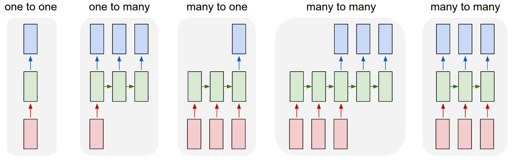

# Redes Neurais Recorrentes

## Introduzindo o Problema

Imagine que você deseja resolver o seguinte problema: 

<em><b>Crie um modelo capaz de copiar as obras de William Shakespeare, escrevendo de forma semelhante ao renomado escritor.</b></em>

Como você poderia possívelmente modelar esse problema para um modelo de *Machine Learning*? Redes Neurais podem ser utilizadas para resolver esse problema ou seria necessário um modelo diferente para resolvê-lo?

## Modelando uma Possível Solução

Primeiramente, podemos utilizar a técnica de *One-Hot Encoding* em cada palavra no vocabulário de Shakespeare. Assim, para cada vocábulo, teremos um vetor grande com todos valores 0 exceto em uma única posição, que representará uma das milhares de palavras usadas pelo escritor. Também podemos levar em consideração "?" e "!" como palavras únicas no modelo. Cada vocábulo que consideramos em nosso One-Hot Encoding é chamado de **token** da rede.

Podemos construir uma sequência de palavras da seguinte forma: Inicialmente, alimentaremos nosso modelo com um indicador de início de frase (Normalmente usamos o token "\<BOS>", que significa "*Begin of Sequence*" ou "Começo de Sequência"). Em seguida, nosso modelo irá gerar uma predição de que palavra será a próxima da sequência. À partir disso, podemos alimentar novamente a rede com a nova palavra gerada repetidamente, criando uma sequência de palavras.

Tal solução pode, de certa forma, gerar frases que minimamente remetem à Shakespeare, entretanto, há um grande problema que nosso modelo anterior não leva em consideração: construimos frases à partir de **contexto**, que é constituído por mais do que apenas uma palavra. Já que nosso modelo leva em consideração apenas uma única palavra anterior, o mesmo não é capaz de gerar frases completamente coerentes, já que "esquece" palavras anteriores à última.

Assim, precisamos construir um modelo semelhante ao anterior, porém capaz de relembrar palavras anteriores à última de alguma forma.

## A Solução: Vetor de Contexto

Como possível solução, podemos passar para nossa rede um vetor extra, chamado de **vetor de contexto**, que guardará informações sobre toda a sequência de tokens geradas até a última predição. Com isso, nosso modelo poderá construir frases bem mais elaboradas, já que poderá lembrar de mais informações, podendo lembrar de frases ou até mesmo parágrafos inteiros.

Mais precisamente, teremos um conjunto de pesos para nosso vetor de contexto, um conjunto de pesos para atualizar o contexto à partir da entrada para nossa rede neural e um conjunto de pesos para realizar a predição da próxima token à partir do nosso vetor de contexto atual. Assim, considerando, respectivamente, $h, x, y$ como o vetor de contexto, a entrada e a saída da nossa rede, podemos escrever as equações:

$$
h_t = \sigma_h(W_x x_t + W_h h_{t - 1} + b_h)
$$
$$
y_t = \sigma_y(W_y h_t + b_y)
$$

Onde $\sigma_h$ e $\sigma_y$ representam funções de ativação da rede. Tais redes apresentam o nome de Redes Neurais Recorrentes (RNNs).

## Redes Neurais Recorrentes

Redes Neurais recorrentes também podem ser utilizadas para outras tarefas que envolvem **séries temporais**, ou seja, redes que recebem informações passadas sequencialmente. Abaixo temos os diferentes tipos de RNNs existentes:

## Recursos Úteis

- [The Unreasonable Effectiveness of Recurrent Neural Networks](https://karpathy.github.io/2015/05/21/rnn-effectiveness/)