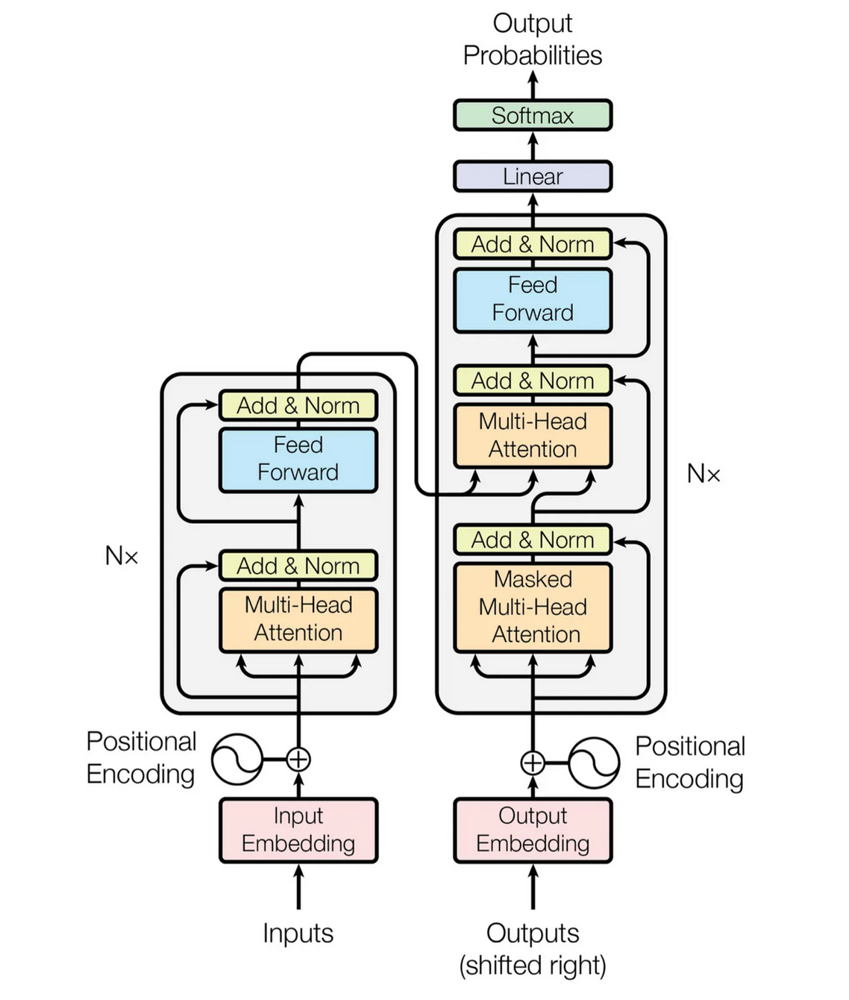

# Transformers

Transformer é uma arquitetura de rede neural apresentada inicialmente em 2017, no artigo "Attention is All you Need"[[Vaswani2017](Bibliografia.md#bibliografia)].
O contexto dessa invenção é o de "Neural Machine Translation" (NMT), isto é, tradução utilizando redes neurais. Entre as inovações apresentadas e possibilitadas por esse novo método de se fazer NMT se destacam um mecanismo chamado "Self-attention" e a natureza, paralelizável do modelo em momento de treinamento, o que representou um enorme avanço em relação às Redes Recorrentes, que possuiam uma natureza inerentemente sequencial, o que dficultava a aplicação de computação paralela para agilizar o treinamento dos modelos.

A arquitetura Transformer foi originalmente apresentada como formada por união de um encoder e de um decoder, como mostra a figura a baixo:

Dessa forma, apresentaremos os conceitos envolvidos nessa arquitetura de modo a possbilitar um entendimento completo dessa ilustração que demonstra bem o funcionamento do modelo.

Nesse sentido, primeiramente faremos um estudo a partir de uma abordagem de atuação do modelo Transformer em uma única frase, e então, conforme a evolução do texto, introduziremos a abordagem matricial dessa arquitetura, o que possibilitará passar da intuição ára um entendimento mais formal da arquitetura.

É recomendável que o leitor já esteja, de certa forma, familiarizado com o conceito de "Attention", primeiramente apresentado no contexto de Redes Neurais Recorrentes, também para NMT.
