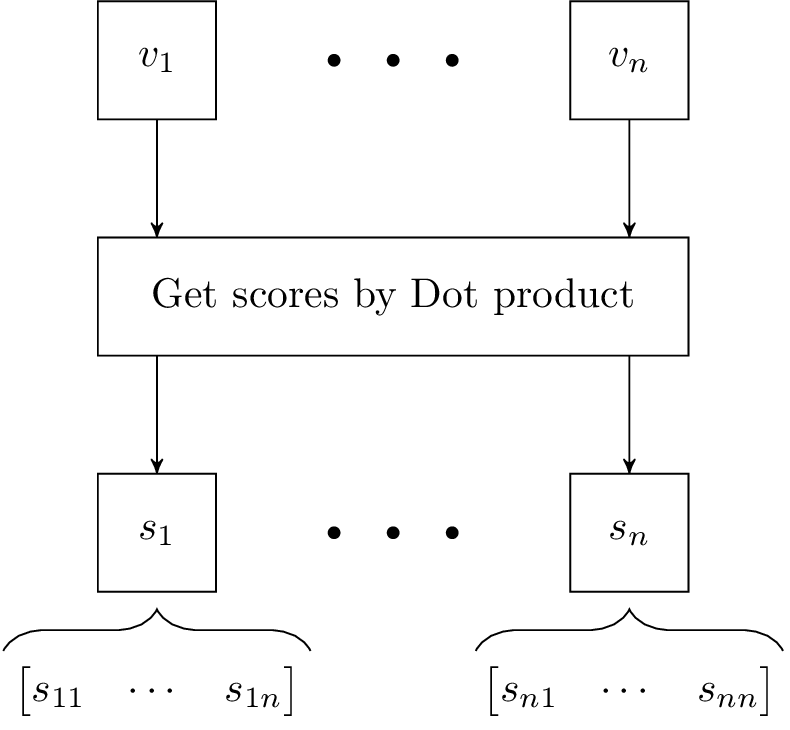
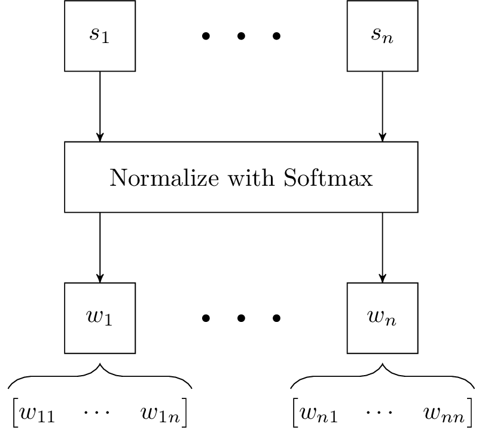
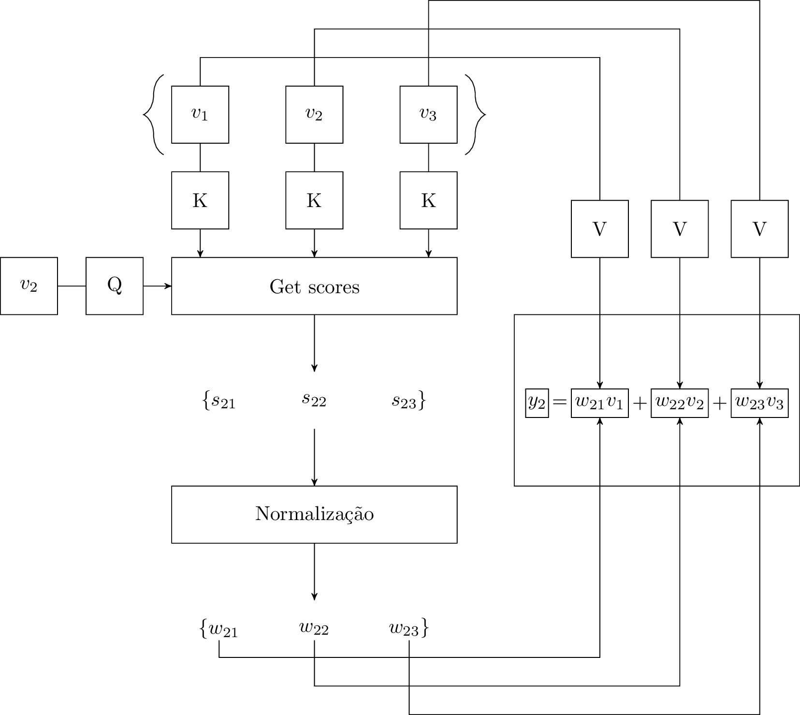

# Self-Attention

A diferença principal entre os conceitos de Attention e Self-Attention[^1] é a seguinte:


Quando falamos do conceito de Attention estamos tentando "alinhar" uma palavra na frase de saída com a palavra correspondente na frase de entrada.

Agora, em Self-Attention, a ideia é fazer um embedding diferenciado de cada palavra. Esse novo embedding considera o contexto da frase para ser produzido.


O mecanismo de Self-Attention associa pesos às palavras vizinhas em uma frase de modo que as palavras vizinhas com os maiores pesos têm maior relevância contextual em relação à palavra sendo analisada.

## Como obter esses vetores contextualizados? Novo embedding?
Agora, como podemos obter esses pesos que são associados às palavras em uma frase (vetores de contexto)?
O primeiro passo é definir um vetor $$s_{ij}$$ tal que:
$$
s_{ij} = v_i \cdot v_j
$$
Isso é o produto escalar entre as palavras $$v_i$$ e $$v_j$$. Note que, por definição,
$$
v_i \cdot v_j = \|v_i\|\|v_j\|\cos{\theta}
$$

Como o valor do cosseno será maior para $$\theta$$ pequeno, esse produto escalar nos dará valores altos para palavras cujos embeddings estão próximos no espaço n-dimensional.

Depois disso, normalizamos os valores desses scores com Softmax.


Note que esse peocesso é muito semelhante ao processo de obtenção dos pesos $$\alpha_{ij}$$ em Attention. A diferença é que, naquele caso, fazíamos score de semelhança entre uma palavra do output para cada vetor de contexto do input. Já aqui, fazemos isso entre as palavras do input (no encoder).


## Normalizando
$$
w_{ij} = \text{softmax}(s_{ij}) = \dfrac{e^{s_{ij}}}{\sum^n_{k=1}s_{ik}}
$$
Aqui, cada vetor de score $$(s_1, \ldots, s_n)$$ estará normalizado tal que $$\sum^n_{i=1}w_i = 1$$.

Agora, nós vamos utilizar esses vetores de pesos $$(w_i)$$ como segue:
$$
y_i = \sum^n_{j=1}w_{ij} \cdot v_j
$$

Note que, dessa maneira, teremos $$n$$ vetores $$y_i$$ que são somas dos vetores das palavras multiplicadas pelos pesos $$w_{ij}$$.


O vetor $$y_i$$ será mais influenciado pelas palavras $$v_j$$ tais que $$w_{ij}$$ é maior. Isto é, palavras $$j$$ com maior relação com a palavra $$i$$.


$$y_i$$ é a forma contextualizada do vetor $$v_i$$. Note que o termo $$w_{ij} \cdot v_i$$ de $$y_i$$ é tal que $$w_{ij} \cdot v_i = v_1$$;


Nesse ponto, há considerações importantes.

Primeiramente, note que estamos usando os mesmos vetores de palavras $$v_i$$ em três papeis distintos:

* 1º e 2º: usamos $$\underline{v_i} \cdot \underline{v_j}, \; j = 1, \ldots, n$$ para obter scores.
* 3º: usamos $$w_{ij} \cdot \underline{v_j}$$ para obter $$y_i$$

Assim, esses vetores estão sendo colocados de maneira crua nessas operações, que buscam obter o vetor $$y_i$$ contextualizado.

Isso não faz sentido, pois somente o embedding cru (usado nos vetores de palavras e no dot product) não será suficiente para explorar o contexto da frase.

Imagine que, se isso acontecesse, no espaço n-dimensional poderia ocorrer de: 
$$
\|v_1\| << \|v_2\|
$$

Assim, se computássemos $$y_1$$ daquela maneira ingênua, $$y_1$$ poderia acabar sofrendo uma influência indevida de $$v_2$$ somente por sua norma ocasionada pelo embedding ser muito grande.


Para abordar essa questão, inserimos matrizes de pesos treináveis (Q, K, V) para reger a influência dos vetores de palavras $$v_i$$ no 1º, 2º e 3º estágio de obtenção dos vetores contextualizados $$y$$.


Note que, como essas matrizes serão obtidas treinando o modelo focando na captura de informação sobre contexto, elas serão capazes de explorar as características de contexto melhor que o embedding cru. Isso faz sentido?}


Perceba que a intuição de que as matrizes Q, K, V serão capazes de capturar inteiramente as características de contexto pode parecer frágil. Ainda pensando que existem diversos contextos diferentes (semânticos) em uma mesma frase. Essas matrizes poderiam se especializar em representar o contexto de forma análoga ao embedding... (Afinal, de certa forma embedding também considera contexto).

Daí surge o conceito de multi-headed Attention. Introduzimos diversas Q, K, V... Isto é, várias camadas da figura 1. Desse modo, teremos, ao final do processo, um embedding contextualizado para cada camada. A ideia é que cada um desses vetores $$y$$ seja uma representação contextual diferente da palavra em relação à frase.

Então, como queremos somente um vetor que contenha toda essa informação, concatenaremos esses vetores $$y$$ e depois o fazemos passar por uma matriz de pesos W que fará esse vetor concatenado ter a dimensão (tamanho) desejado para y.


Como funciona o treinamento para ajuste de pesos Q, K, V e W?

Acho que precisamos chegar ao final do decoder para começar a visualizar isso


[^1]: Vaswani, A., Shazeer, N., Parmar, N., Uszkoreit, J., Jones, L., Gomez, A. N., Kaiser, L., and Polosukhin, I. (2017). Attention is all you need.
