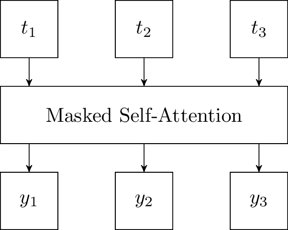
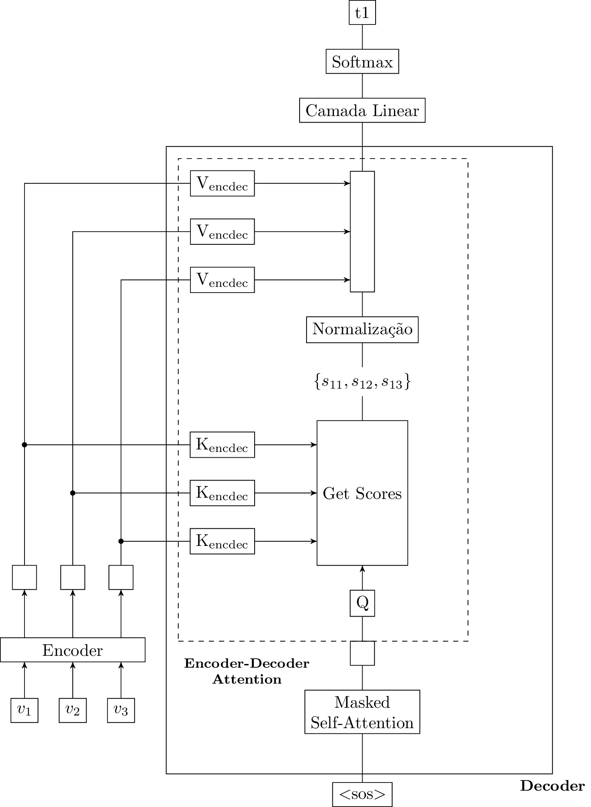

# Decoder da arquitetura Transformer

Como vamos do embedding contextualizado entregue pelo encoder de Transformer para uma frase em outro idioma (no contexto de tradução).

A partir de uma perspectiva de muito alto nível, o encoder e o decoder interagem da seguinte maneira:


Novas matrizes K e V?


Aqui, podemos pensar primeiramente sobre o mecanismo de masked Self-Attention.


Considerando que Masked Self Attention faz com que o modelo não roube durante o treinamento, como esse mecanismo atua durante inferência?



Input do decoder é diferente em treinamento e inferência:

* Treinamento: frase inteira → paralelização.
* Inferência: uma palavra por vez. Inferência precisa da natureza sequencial.



Em treinamento a frase predita **y** é predita de uma só vez? Todas as palavras simultaneamente?

Input diferente ⇒ output diferente?

Acho que isso faz sentido. Talvez possamos inferir todas as próximas palavras simultaneamente.


## Masked Selft-Attention
Na prática, quando estamos falando de Transformers Decoder, temos a seguinte figura esquemática:

Aqui, o podemos diferenciar o funcionamento do decoder em estágio de treinamento e inferência. Primeiramente trataremos do período de treinamento.

## Decoder em Estágio de Treinamento
Nessa situação, podemos pensar que o modelo recebe como inputs os seguintes dados:

1. Frase inteiramente traduzida
2. embeddings contextualizados das palavras no idioma original.

Em um primeiro momento de atuação do Decoder, a frase inteiramente traduzida é submetida à Masked Self Attention.

Aqui, a ideia é estabelecer a relação do próximo output (próxima palavra predita) com os outputs anteriores.


Podemos pensar em uma analogia com os hidden states do decoder de uma RNN


Para entender como Masked Self Attention funciona, podemos pensar na matriz de Self-Attention:

Dado as palavras: $$t_1, t_2  \text{ e } t_3$$ ($$t$$ de "traduzido"), temos a seguinte matriz:


Como os Transformers lidam com a geração de frases traduzidas que tenham comprimento diferente do da frase no idioma original?



Isso depende de quando o $$<$$EOS$$>$$ será predito. Podemos lembrar do funcionamento de RNNs.


Onde o elemento $$ij$$ denota a intensidade da relação contextual entre as palavras $$t_i$$ e $$t_j$$.

Agora, perceba que, em momento de treinamento, como já possuímos a frase traduzida inteira ($$t_1, t_2 \text{ e } t_3$$), essa matriz pode ser inteiramente preenchida no momento inicial. Ou seja, podemos traçar as relações contextuais: $$t_1t_1, t_1t_2, t_1t_3$$ mesmo que, na prática, em momento de inferência, isso não seria possível (já que ainda não existiria $$t_2$$ ou $$t_3$$).

Nesse ponto, entra o conceito de Masked Self-Attention A ideia aqui é transformar a matriz de Sel-Attention (ilustrada anteriormente) em algo do tipo:


Após Softmax, cada $$-\infty$$ se torna 0


Desse modo, perceba que, apesar da frase inteira estar disponível, a matriz de Self-Attention resultante estará simulando o que ocorre em tempo de inferência.

Ou seja, $$t_1$$ só pode ter relação contextual analisada com $$t_1$$. → Somente $$t_1t_1$$.

$t_2$ pode ter relação com $$t_1$$ e $$t_2$$. ⇒ $$t_2t_1;t_2t_2$$.

E assim por diante. Perceba que dessa maneira podemos dar a frase inteira como input simulando uma geração sequencial das palavras.

Esse estágio de Self-Attention no Decoder é muito importante pois a próxima palavra traduzida prevista não está somente em função do output do Encoder. Essa palavra deve estar em função de todas as palavras anteriormente traduzidas.

### Encoder-Decoder Attention
Nesse ponto, depois de passarmos por Masked-Self Attention, com o que estamos lidando?

Primeiro obtemos a matriz de self-attention e a utilizamos para obter o embedding contextualizado de uma palava traduzida em relação à própria frase traduzida.

Aqui, segundo um esquema de self-Attention muito semelhante ao ilustrado em (), no momento de treinamento, cada palavra da frase traduzida origina um vetor $$y$$:

Agora, chegamos à etapa de Attention entre Encoder e Decoder. Esse conceito de Attention é muito semelhante ao proposto por Attention[^2], no qual quantificamos a relação contextual da próxima palavra predita com todas as palavras da frase no idioma original.

Perceba que se formos utilizar a analogia de Q, K, V nesse caso de Encoder-Decoder Attention, poderemos pensar em um esquema como o seguinte:

Desse modo, cada vetor contextualizado resultado do Encoder é relacionado com cada vetor contextualizado da palavra sendo predita com as palavras da frase original. Obtemos scores dessa relação. A palavra mais relacionada terá maior score e, então, influenciará mais o output.

Ao final de uma camada de Transformer's Decoder, teremos um output influenciado por todas as palavras (contextualizadas) da frase original e pelas palavras já traduzidas (contextualizadas).

### Considerações Sobre Treinamento
É razoável pensar tradução como um problema de classificação. Portanto, podemos usar Cross-Entropy como função de perda.


Em momento de treinamento, o erro de uma predição não é propagado para a predição das próximas palavras traduzidas.

Assim, de fato usamos como ``palavras previamente traduzidas'' as palavras corretamente traduzidas. Esse conceito é conhecido como ``teacher forcing''.

Isso faz com que o processo de treinamento de uma rede Transformer seja totalmente paralelizável.




O Encoder é treinado juntamente com o Decoder no contexto de tradução de texto?



Acredito que, nessa abordagem de Transformer, como mostrado em Self-attention[^1], Encoder e Decoder são trainados em conjuntom como uma mesma rede (que são)

Contudo, as arquiteturas Encoder/Decoder poderiam ser treinadas separadamente. Por exemplo as aquiteruras Encoder only (BERT) e Decoder only (GPT)


[^1]: Vaswani, A., Shazeer, N., Parmar, N., Uszkoreit, J., Jones, L., Gomez, A. N., Kaiser, L., and Polosukhin, I. (2017). Attention is all you need.
[^2]: Bahdanau, D., Cho, K., and Bengio, Y. (2014). Neural machine translation by jointly learning to align and translate.

