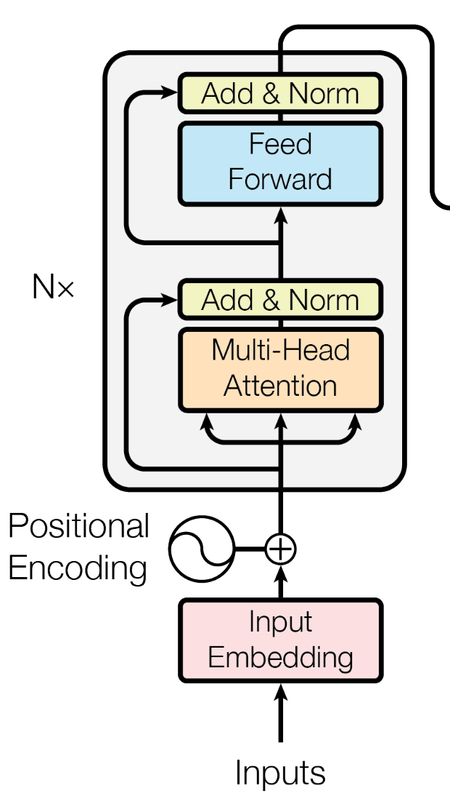

# Encoder da arquitetura Transformer

Agora que já passamos pelo importante conceito de Self-Attention, podemospassar a interpretar a arquitetura Transformer a partir de uma perspectiva mais macro, considerando seus componentes principais: encoder e decoder.

Assim, vamos abordar o encoder.

Considerando a imagem do encoder presente no paper Attention is All you Need, temos:

Primeiramente injetamos informação posicional nos inputs. Isso é representado pelo bloco de Positional Encoding.
Depois disso, entramos de fato no encoder. Cada bloco de encoder possui os seguintes componentes:

1. Multi-Head Attention
2. Add & Norm
3. Feed Forward
4. Add & Norm

Como já comentado anteriormente, depois que os inputs passam por Multi-Head Attention, eles se tornam vetores com informações sobre contexto.

Agora, qual o motivo do bloco Add & Norm?

## Add & Norm

No caso da figura do paper, Add & Norm indica que o resultado de cada sub-camada (Multi-Head Attention e Feed Forward) do encoder é dado por:

$$
\text{LayerNorm}\left( x + \text{Sublayer}(x)\right)
$$

Na prática isso mostra uma conexão residual entre o resultado de uma camada do modelo e o input dessa camada. A explicação mais intuitiva e usual para essa prática é que essas conexões residuais auxiliam no problema de _vanishing gradients_.

Além disso, como o próprio nome diz, o processo de normalização faz com que tenhamos (após cada camada da rede neural) valores com média 0 e desvio padrão 1. Como teremos valores sem grande variância e centrados em 0, isso faz com que os passos de gradiente tenham valores absolutos consistentes e dentro de um intervalo definido. Desse modo, teremos _learning steps_ de tamanhos semelhantes e o processo de aprendizado se torna mais estável. [[CodeEmporium-LayerNorm](Bibliografia.md#bibliografia)]

## Feed Forward
Nesse ponto, os vetores originados pelos inputs passam por uma rede fully connected (FFN). Algo importante de se notar é que essa FFN é "position wise". Isso quer dizer que os tokens de cada posição da frase não se comunicarão entre si. Isto é, a FFN têm um escopo de atuação restrito à cada token. Observe:

$$
\text{FFN}(x) = \text{ReLU}(xW_1 + b_1)W_2 + b_2
$$

Onde $$x = C[i, :]$$, isto é, um vetor originado por uma palavra.

A partir disso, é possível observar que essas FFN é uma rede com duas camadas. A primeira ($$W_1$$) é tal que:
$$W_{1(d \times d_{ff})}$$. Isso quer dizer que mapeamos o vetor de um token (que possui $$d$$ posições) para um vetor de dimensão $$d_{ff}$$. Depois disso, precisamos fazer com que esse vetor volte a possuir dimensão $$d$$. Então, a segunda camada dessa rede ($$W_2$$) é tal que: $$W_{2(d_{ff} \times d)}$$

Uma maneira de entender a função desse processo na arquitetura Transformer é que as FFN's possuem pesos treináveis para adaptar os tokens de saída de uma camada de Attention, otimizando-os para se tornarem a entrada da próxima camada de Attention.

Assim, o funcionamento do encoder do Transformer é dado por uma repetição de $$\text{N}$$ vezes desse processo. Ao final disso, cada token de input se tornou uma versão altamente contextualizada de si mesmo, que é mais próxima (no espaço n-dimensional) das palavras na frase que possuem maior semelhança contextual. Então, essa matriz final (cujas linhas são as representações contextualizadas dos tokens) é um dos dados de entrada do decoder dos Transformers. 
