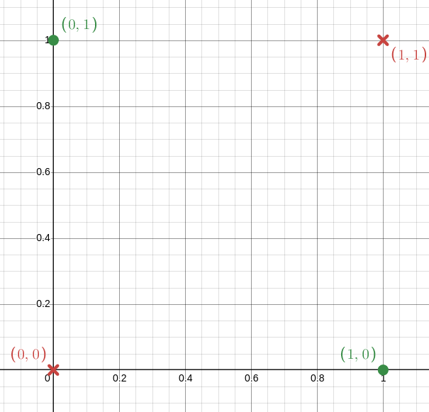
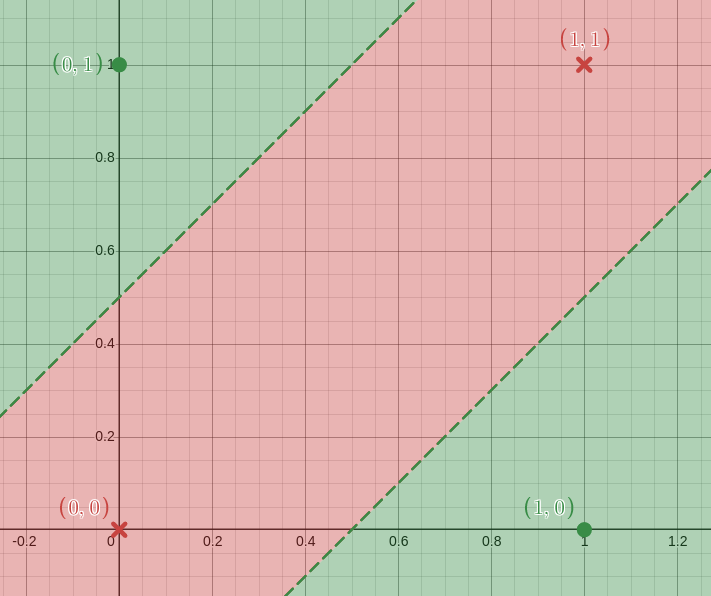
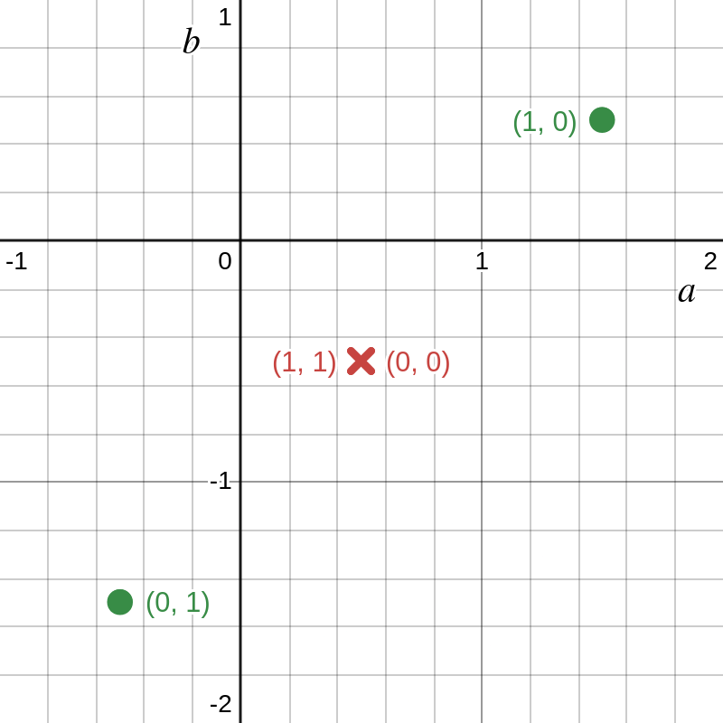
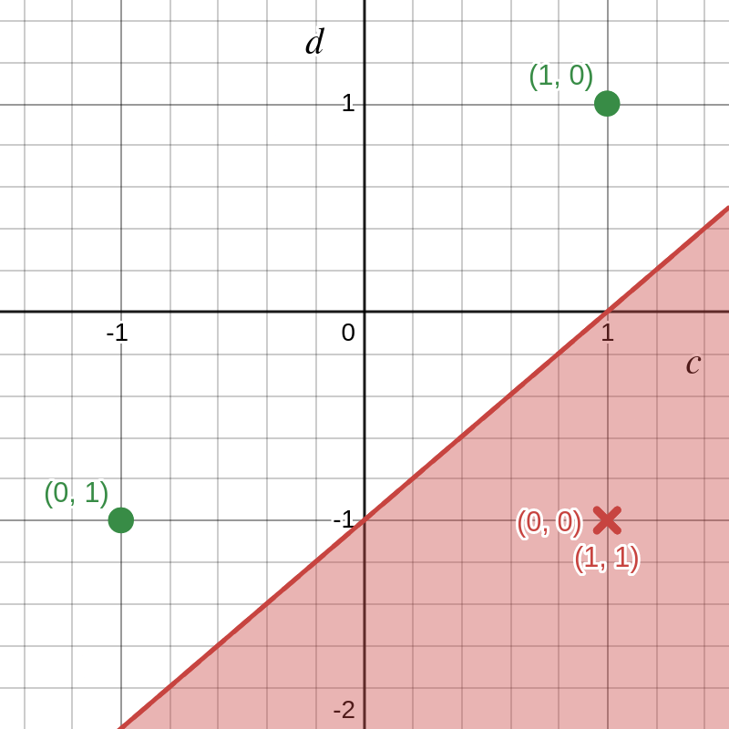
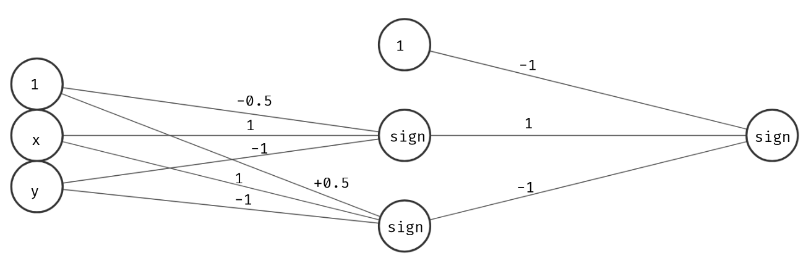

# Multilayer Perceptron

Vimos no capítulo sobre Perceptron que esse tipo de algoritmo é útil apenas para conjuntos **linearmente ** separáveis. O que não foi dito, entretanto, é que podemos combinar diversos perceptrons para resolver problemas mais complexos. 

Para entender melhor isso, vamos investigar o "problema do XOR".

## O problema do XOR

Vamos supor que queremos aproximar a função XOR. Isto é, dado um ponto $$(x, y)$$, queremos aproximar $$x XOR Y$$. Temos em nosso conjunto de treinamento os seguintes pontos:

Podemos perceber claramente que esse conjunto de dados **não** é linearmente separável. Isto é: não existe linha que separe os pontos em duas categorias. Portanto, um perceptron simples não poderia aprender essa função.

Podemos, entretanto, resolver o problema usando duas linhas. Um exemplo é o seguinte, com as linhas $$x - y + 0.5 = 0$$ e $$x - y - 0.5 = 0$$:

Observe, agora, a imagem. Como classificamos os pontos? Podemos intuir duas regras (nomeia a linha de cima como A, e a de baixo como B):

- Se um ponto está abaixo da linha A e acima da linha B, esse ponto é da classe 0.
- Se não, é da classe 1.

Portanto, precisamos extrair duas características desses pontos: se eles estão acima da linha A e se eles estão acima da linha B. Isto é: se $$a(x, y) = x - y + 0.5 > 0$$ e $$b(x, y) = x - y - 0.5 > 0$$. Hmm, vamos testar uma ideia: vamos tentar calcular as funções $$ a $$ e $$ b $$ para nossos pontos e colocá-los em um gráfico

Hmm, ainda não conseguimos separar os pontos com uma única linha... Isso nos ensina uma lição importante: a aplicação de funções lineares não transforma um conjunto não-linearmente separável em linearmente separável. Vamos tentar alterar, então, essas funções. Defina $$c(x)$$ e $$d(x)$$ tais que:

$$c(x) = sign(a(x)) $$

$$d(x) = sign(b(x)) $$

Vamos ver como fica no gráfico?

Agora sim! Podemos separar os pontos com uma linha! Vamos revisar o que estamos fazendo:

- Para cada ponto, extraimos duas características: acima da linha A e acima da linha B. Utilizamos as equações das linhas para definir duas funções. O sinal do resultado dessas funções é extraído como característica.
- Combinamos essas duas características para definir a classe do ponto.

## Multi-layer Perceptron

Essa é a ideia por trás dos Multi-Layer Perceptrons. A função sign é chamada de **função de ativação** e precisa ser **não-linear**. Escolhas comuns incluem a função **sign**, **step**, **tanh**, **sigmoid** e **ReLU**. Os coeficientes que multiplicam **x** e **y** (1 e -1, no nosso exemplo) são os **pesos** e os números que são somados ao final são o **viés**.

Vamos entender, então, como é a estrutura de um MLP. Todo MLP é dividido em **camadas**. Cada camada possui diversos **neurônios**. No exemplo que demos, temos 3 camadas: a camada de entrada, a camada de saída e uma **camada oculta**.

Cada neurônio combina linearmente as saídas dos neurônios da camada anterior, soma um **viés** e passa o resultado por uma **função de ativação**. Seja $$ \theta $$ a função de ativação escolhida. A saída do neurônio é computada da seguinte forma:

$$ f(x_1, x_2, \cdots, x_n) = \theta( w_1x_1 + \cdots + w_nx_n + b) $$

No nosso exemplo, anterior, construímos a seguinte rede:

## Recursos úteis
- [Demystifying the XOR Problem](https://dev.to/jbahire/demystifying-the-xor-problem-1blk)
- [How Neural Networks Solve The Xor Problem](https://towardsdatascience.com/how-neural-networks-solve-the-xor-problem-59763136bdd7)
- [Neural Network XOR Application and Fundamentals](https://becominghuman.ai/neural-network-xor-application-and-fundamentals-6b1d539941ed)