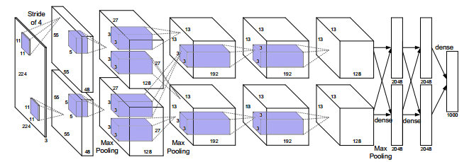
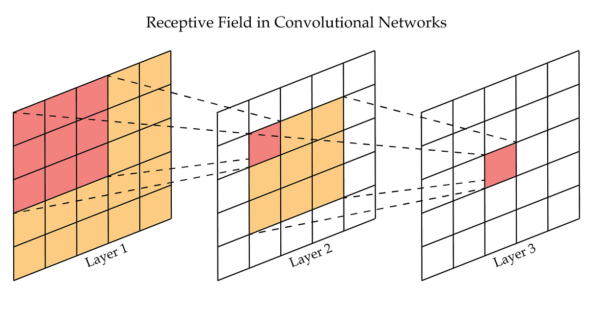

# Redes convolucionais

No último capítulo, vimos o que é uma camada convolucional. Agora, vamos entender a ideia por trás de uma rede convolucional.

Para isso, precisamos entender porque não é prático utilizar redes neurais convencionais para imagens. Assuma uma imagem colorida com dimeneões 512x512. Se quisermos processar essa imagem com uma rede neural convencional, teremos $$3 \cdot 512 \cdot 512 = 786432$$ dimensões na camada de entrada. Assuma uma camada oculta com apenas 128 neurônios (uma camada bastante pequena). Apenas entre essas duas camadas, já teremos $$100663296$$ parâmetros! Isso é completamente ineficiente.

Qual a solução, então? Extrair **características** da imagem. Essas podem ser de todo tipo: simetria, níveis de preto, contraste, presença ou ausência de padrões, etc. Todas essas características servirão de entrada para rede. De repente, conseguimos diminuir a dimensão da camada de entrada de várias centenas de milhares para algumas dezenas.

Entretanto, um desafio ainda permanece: como escolher essas características? Podemos aplicar convoluções às imagens para calcular características interessantes, e essas convoluções podem ser aprendidas junto com o restante da rede!

## Estrutura de uma rede convolucional.

É importante entender alguns detalhes essenciais sobre essas redes antes de prosseguir. Cada camada convolucional possui três dimensões: altura, largura e número de canais. A camada de entrada possui, geralmente, 1 canal, para imagens preto e branco, ou 3 canais para imagens coloridas.

Cada canal de cada camada convolucional combina todos os canais da camada anterior. Isto é: as "janelas" utilizadas possuem pesos para todos os canais. Observe a imagem abaixo para entender melhor:

As áreas destacadas em azul mostram as dimensões das janelas. Essas janelas são passadas pelos dados da camada anterior para gerar **um canal** da próxima camada.

Vamos entender isso com um exemplo. Suponha uma rede que processa imagens coloridas de 128 pixels por 128 pixels. Essa rede possui 3 camadas convolucionais, com 16, 32 e 64 canais por camada, especificamente. Suponha uma janela de tamanho 3 para todas as camadas. Com isso, temos:

- Primeira camada: dimensão da janela é 3x3x3. Como temos 16 canais de saída, teremos 16\*3\*3\*3= 432 parâmetros.
- Segunda camada: dimensão da janela é 3x3x16. Como temos 32 canais de saída, teremos 32\*3\*3\*16 = 4608 parâmetros.
- Terceira camada: dimensão da janela é 3x3x32. Como temos 64 canais de saída, teremos 64\*3\*3\*32 = 18432 parâmetros.

Outro detalhe importante é a dimensão da saída de cada camada. Isso depende da utilização ou não de **padding**. **Padding** é o comportamento da camada nas bordas da imagem. Podemos completar a imagem com zeros, com o valor do pixel mais próximo, ou com o valor do pixel na outra extremidade da imagem. Se padding não for utilizado, as dimensões de saída diminuirão por $$2\lfloor \frac{W}{2} \rfloor $$, onde W é o tamanho da janela. Por exemplo, para uma janela de tamanho 3, cada camada diminuirá a imagem em 2 pixels. Se a entrada é de 128x128, a saída da 1ª camada será 126x126; da segunda, 124x124; e assim por diante.

## Pooling

Lembre-se que cada convolução extrai uma característica da imagem. Portanto, quando fazemos outra convolução com as saídas da camada anterior, estamos combinando características extraídas da imagem para computar novas características. Com isso, camadas mais profundas extraem características mais complexas da imagem. Se a primeira camada extrai características como presença de linhas retas verticais, a décima pode extrair coisas como "presença de focinhos de cachorros". 

As características envolvidas, portanto, vão se tornando cada vez menos locais, e mais globais (referentes à imagem toda). Por isso, é útil resumir as informações em dimensões menores conforme a rede vai se aprofundando.

Para isso, utlizamos camadas de "pooling". Essas camadas funcionam de forma semelhante à uma convolução: janelas deslizam pelos dados e computam uma saída baseada em pixels próximos. Entretanto, dessa vez, é utilizada uma função para agregar esses dados. Algumas funções comuns são "max"(valor máximo) e "avg"(valor médio).

## Campo receptivo

Um conceito importante para entender o poder de **redes convolucionais profundas** é o de **campo receptivo**. Esse conceito tem a ver com o poder que convoluções encadeadas têm.

Para isso, suponha uma imagem de entrada. Aplique uma convolução 3x3 nela. Agora, aplique uma nova convolução 3x3 na saída da convolução anterior. Observe, agora, essa imagem de saída. Cada pixel dela possui informações de quantos de seus vizinhos?

A resposta é que cada pixel possui informação de uma região de tamanho 5x5 em volta dele! Isso é o campo receptivo desses neurônios.

Uma concepção errada que algumas pessoas têm é de imaginar que, como o campo receptivo de duas convoluções 3x3 é de 5x5, duas convoluções 3x3 têm o mesmo **poder de expressão** de uma convolução 5x5. Isso **não** é verdade. Uma convoçução 5x5 têm 25 parâmetros, enquanto duas convoluções encadeadas 3x3 possuem apenas 18 parâmetros. 
## Recursos Úteis
- [Curso de Stanford](https://www.youtube.com/watch?v=vT1JzLTH4G4&list=PL3FW7Lu3i5JvHM8ljYj-zLfQRF3EO8sYv)
- [Convolutional Neural Networks, explained](https://towardsdatascience.com/convolutional-neural-networks-explained-9cc5188c4939)
- [Receptive Fields in Deep Convolutional Networks](https://medium.com/@rekalantar/receptive-fields-in-deep-convolutional-networks-43871d2ef2e9)