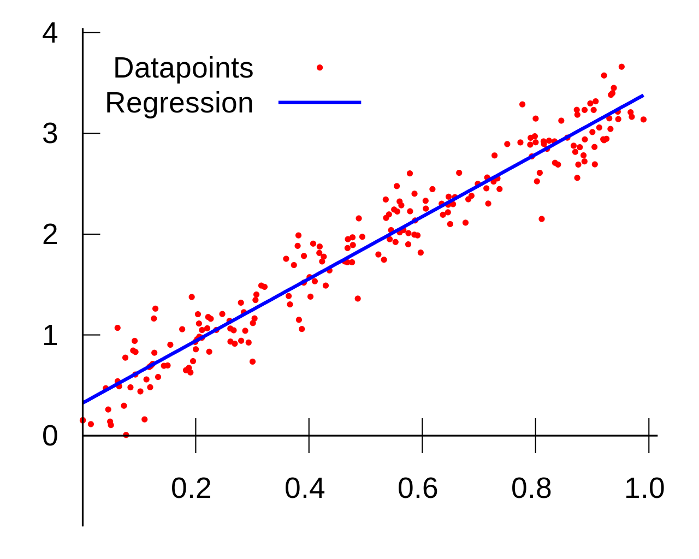
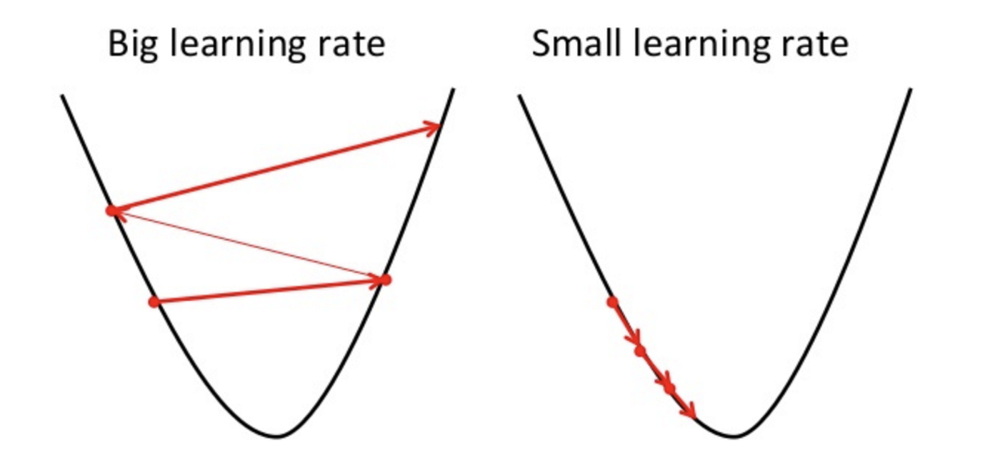

# Regressão Linear

A regressão linear é um dos primeiros tópicos que estudantes de aprendizado de máquina costumam aprender quando estão iniciando seus estudos na área. Isto ocorre pois a regressão linear é um método fácil de ser ensinado, implementado, e pode ser utilizado como um modo de se ter uma noção melhor do que significa aprendizado e de técnicas que envolvem algotimos mais complexos.

## Ideia principal

Imagine que você possui uma série de pontos em um gráfico, esses pontos formam o nosso conjunto de dados de aprendizado, a ideia por trás da regressão linear é encontrar a reta que mais se aproxima da distribuição dos nossos pontos. Exemplificando:

Aparentemente, a reta se ajusta bem à distribuição de dados, o que é verdade, mas precisamos primeiro definir a métrica que nos permite comparar duas retas e dizer qual delas melhor se "ajusta" à distribuição de dados. Imagine que nossa reta genérica é de formato $$ f(x) = ax+b $$ e nosso conjunto de dados é formado por pontos $$(x_i,y_i)$$, poderíamos adotar como métrica simplesmente a soma do erro para cada ponto, o que nos daria:

$$
    Erro = f(x_0) - y_0 + f(x_1) - y_1 + ...
    \implies
    Erro = \sum_{i = 0}^{N}f(x_i) - y_i
$$

Todavia, note que se nosso conjunto de dados fosse formado por $$(1,2)$$ e $$(2,-2)$$, e também nossa reta tivesse como resultados $$f(1) = 0$$ e $$f(2)=0$$, nosso erro final seria:

$$
    Erro = (0 - 2) + (0 - (-2)) = -2 + 2 = 0
$$

Ou seja, essa métrica acaba não sendo muito útil devido ao fato dela abrir margem para que um erro possa anular outro e nos impedir de perceber que uma reta candidata é uma má reta. Desse modo, podemos adicionar um quadrado nos termos do somatório, desse modo todos os erros ficam positivos e temos uma noção melhor do que está acontecendo, chamamos esse erro de erro quadrático . Assim sendo:

$$
    Erro = \sum_{i=0}^{N} (f(x_i) - y_i)^2
$$

Porém, imagine que sua quantidade de pontos é muito grande. Em um computador, talvez uma soma de quadrados tão grande possa acarretar em overflow ou acarretar no acúmulo de erros de precisão. Desse modo, é interessante que, ao invés de utilizarmos o erro quadrático simples, seja utilizado o erro quadrático médio - *Mean Squared Error (MSE)*:

$$
    Erro = \frac{\sum_{i=0}^{N} (f(x_i) - y_i)^2}{N}
$$

Com a nossa métrica de erro estabelecida, finalmente podemos comparar retas e formalizar nosso objetivo: **encontrar uma reta que minimiza o erro quadrático médio**.

## Quando o erro é mínimo

Na matéria de cálculo é aprendido o que é o gradiente de uma função, um conceito essencial não só para a regressão linear, mas também para a área de aprendizado de máquina como um todo, especialmente no que se refere a redes neurais, que é um tópico muito importante na área e que será apresentado no futuro. Simplificando, o vetor gradiente de uma função indica a direção e a taxa de variação máxima de uma função em um determinado ponto, ou seja: a direção que a função cresce mais rápido em determinado ponto. Desse modo, quando o gradiente de uma função é zero em um determinado ponto, isso significa que aquele ponto é crítico, isso é: ou aquele ponto é máximo (local ou global), ou é mínimo (local ou global), ou é um ponto de sela, para funções $$\mathbb{R}^2 \rightarrow \mathbb{R}$$. Como nossa função de erro é estritamente positiva, então sabemos que o ponto onde o gradiente dela é zero é o erro mínimo que podemos chegar.

Para calcular o vetor gradiente precisamos encontrar as derivadas parciais de uma função. Relembrando nossa função de erro:

$$
    Erro = \frac{1}{N} \sum^{N}_{i=0}(f(x_i)-y_i)^2 
    \implies
    Erro = \frac{1}{N} \sum^{N}_{i=0}((ax_i+b)-y_i)^2
$$

Abrindo o quadrado:
$$
    Erro = \frac{1}{N} \sum^{N}_{i=0}((ax_i+b)^2- 2(ax_i+b)y_i+y_i^2) \implies
    Erro = \frac{1}{N} \sum^{N}_{i=0}(a^2x_i^2+2ax_ib+b^2 - 2ax_iy_i - 2by_i + y_i^2) 
$$

Desse modo, calculando a derivada parcial da função de erro em $$a$$:

$$
    \frac{\partial Erro}{\partial a} = \frac{1}{N} \sum^{N}_{i=0}(2x_i^2a + 2x_ib - 2x_iy_i)
    \implies
    \frac{\partial Erro}{\partial a} = \frac{2}{N} \sum^{N}_{i=0}(x_i^2a + x_ib - x_iy_i)
$$

$$
    \frac{\partial Erro}{\partial a} = \frac{2}{N} \sum^{N}_{i=0}(x_i^2a + x_ib - x_iy_i)
    \implies
    \frac{\partial Erro}{\partial a} = \frac{2}{N} \sum^{N}_{i=0}x_i(x_ia + b - y_i)
$$

$$
    \frac{\partial Erro}{\partial a} = \frac{2}{N} \sum^{N}_{i=0}x_i(x_ia + b - y_i)
    \implies
    \frac{\partial Erro}{\partial a} = \frac{2}{N} \sum^{N}_{i=0}x_i(f(x_i) - y_i)
$$

Agora, calculando a derivada parcial da função de erro em $$b$$:

$$
    \frac{\partial Erro}{\partial b} = \frac{1}{N} \sum^{N}_{i=0}(2ax_i+2b-2y_i)
    \implies
    \frac{\partial Erro}{\partial b} = \frac{2}{N} \sum^{N}_{i=0}(ax_i + b - y_i)
$$

$$
    \frac{\partial Erro}{\partial b} = \frac{2}{N} \sum^{N}_{i=0}(ax_i + b - y_i)
    \implies
    \frac{\partial Erro}{\partial b} = \frac{2}{N}\sum_{i=0}^{N}(f(x_i)-y_i)
$$

Resta encontrar os coeficientes, ou pesos, a e b que levem ambas as derivadas parciais para zero, assim teremos encontrado a melhor reta possível. Para encontrar esses pesos, iremos utilizar um algoritmo muito importante chamado Gradiente Descendente.  

## Minimizando o erro

A ideia por trás do algoritmo Gradiente Descendente na verdade é bem simples: dado que o vetor gradiente aponta para a direção de maior crescimento de uma função, então seu inverso deve apontar para uma direção de decrescimento. Encontradas as derivadas parciais, podemos atualizar o valor dos nossos conjuntos de pesos, com $$\alpha$$ sendo um número real positivo, da seguinte forma :  

$$
    a = a - \alpha \frac{\partial Erro}{\partial a}
$$

$$
    b = b - \alpha \frac{\partial Erro}{\partial b}
$$

Repetimos esse processo até que nossa função de erro assuma um valor pequeno que nós escolhemos, esse valor idealmente é zero. O $$\alpha$$ é o que chamamos de *Learning Rate*, ele determina o tamanho do passo que damos em cada iteração, o que é muito importante para que consigamos convergir para o ponto onde o erro é mínimo. Note: 

Na imagem acima temos a curva como sendo o gráfico da nossa função de erro, onde o eixo vertical é o valor da nossa função de erro enquanto o eixo horizontal representa os valores de um determinado parâmetro da função de erro, e a seta vermelha é o vetor inverso do nosso vetor gradiente multiplicado por um determinado learning rate. Assim sendo, com um learning rate grande nós damos passos grandes em uma determinada direção em cada atualização de valor do parâmetro, com os passos sendo representados pelas setas vermelhas, o que pode até ser bom em alguns casos ou momentos e ajude a convergir mais rapidamente, porém ele pode acabar atrapalhando também, como é o caso esquerdo da imagem. Já com o learning rate pequeno temos passos menores, o que nos dá maior confiança de que não passaremos do ponto mínimo, porém ele pode aumentar o número de iterações necessárias para chegar lá.

É importante dizer também que esse algoritmo, apesar de nos dar uma boa aproximação da "reta perfeita", ele dificilmente a encontrará, já que o learning rate que nós escolhemos dificilmente será o learning rate perfeito que nos levará exatamente para o ponto mínimo.

O exemplo que utilizamos possui apenas dois coeficientes e pode ser trabalhado utilizando apenas uma reta. Todavia, a regressão linear pode ser utilizada para dados que vão além de duas dimensões apenas, o que significa que não encontraremos apenas retas, mas hiperplanos.

## Uma solução exata

Existe outra solução para o problema da regressão linear, a qual chamamos de solução analítica. Essa solução utiliza operações matriciais para encontrar de fato a reta perfeita, ao custo de que essa solução pode ser muito demorada dependendo da sua quantidade de pontos no conjunto de aprendizado.

Tomemos agora o nosso conjunto de dados como uma matriz $$X$$, nossos pesos - coeficientes - como outro vetor coluna $$\bold{w}$$, e nossa reta, ou modelo, como $$h(x)$$. Desse modo, temos: 

$$
    h(\bold{x}) = \sum_{i=0}^{N}w_ix_i=\bold{w}^T\bold{x}
$$ 

Nossa função de erro agora pode ser escrita como:

$$
    Erro(\bold{w}) = \frac{1}{N} \sum_{i=0}^{N} (\bold{w}^{T}\bold{x}_i - y_i)^2 
$$

$$
    Erro(\bold{w}) = \frac{1}{N} ||X\bold{w} - \bold{y}||^2
$$

$$
    Erro(\bold{w}) = \frac{1}{N} (\bold{w}X^{T}XX^T - 2\bold{w}^{T}X^{T}\bold{y} + \bold{y}^{T}\bold{y})
$$

Desse modo, nosso gradiente fica:

$$
\nabla Erro(\bold{w}) = \frac{2}{N}(X^TX\bold{w} - X^T\bold{y})
$$

Para que o gradiente seja zero, basta encontrarmos $$\bold{w}$$ que satisfaça $$X^TX\bold{w} = X^T\bold{y}$$. Desse modo, temos $$\bold{w} = (X^TX)^{-1}X^T\bold{y}$$.
## Contribuições

Kaique Oliveira

## Referências
"Learning from data" - Mostafa
