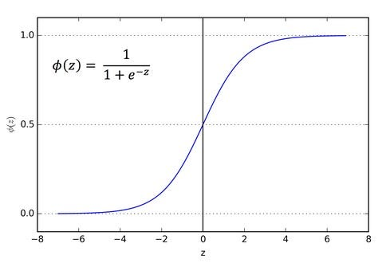
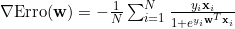
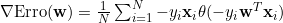

# Regressão Logística

Antes de começar a falar sobre nosso modelo de fato, é interessante primeiro explicar o que é um problema de classificação. Assim como outros problemas em *Machine Learning*, um problema de classificação é um desafio o qual, dado uma entrada, devemos inferir a sua saída. Todavia, diferente da regressão, na classificação temos um conjunto finito de saídas possíveis. Por exemplo: imagine que você é o gerente de um banco e, dado um conjunto de informações sobre a vida financeira de uma pessoa, você deve decidir se é uma boa ideia conceder um empréstimo para um cliente. Perceba que nesse problema a saída é binária e, portanto, finita: ou você concede o empréstimo, ou não concede o empréstimo - ou é uma boa ideia, ou não é.

A regressão logística é um método que dialóga muito com problemas de classificação, apesar de ser um modelo de regressão. Assim como a regressão linear, a regressão logística tem como saída um valor real. Todavia, esse valor real é limitado no intervalo [0,1], de modo que a saída pode ser interpretada como uma probabilidade. Assim sendo, podemos utilizar esse modelo para inferir a probabilidade de uma saída de um problema de classificação. No nosso problema, uma saída da regressão logística poderia ser a probabilidade 0.7, ou seja, "a chance de ser uma boa ideia conceder o empréstimo é de 70%, logo, conceda o empréstimo".

## Ideia Principal

A regressão logística é um modelo linear, o que nos possibilita dizer que, assim como a regressão linear, ela é baseada em um sinal $$s = \bold{w}^{T}\bold{x}$$, com $$\bold{w}$$ sendo um vetor coluna de pesos e $$\bold{x}$$ sendo um vetor coluna que representa a entrada do nosso modelo. Nesse sentido, para que consigamos transformar esse sinal $$s$$ em um valor entre [0,1], uma forma possível é utilizar uma função logística $$\theta(s)$$ cujos resultados são limitados entre 0 e 1 e é definida como:

$$
    \theta(s) = \frac{e^s}{1+e^s}
$$

Essa função, chamada sigmoide, é muito interessante e estudaremos ela para problemas de saída binária (por exemplo, se um banco deve ou não aprovar crédito para uma pessoa com base nos seus dados bancários). A sigmoide é uma função diferenciável em todos o seus pontos e é limitada a valores entre zero e um, o que nos permite utilizá-la para problemas probabilísticos e que utilizam de derivadas. Note que o que nós queremos que nosso modelo faça é prever a probabilidade de que uma saída $$y_i$$ seja 1 ou -1 dado $$\bold{x}_i$$. Desse modo, levando em consideração que $$1-\theta(s) = \theta(-s)$$, podemos escrever:

$$
    P(y_i|\bold{x}_i) = \theta(y_i\bold{w}^T\bold{x}_i)
$$ 

Essa é uma forma conveniente de se entender o problema, visto que assim não precisamos tratar os casos +1 e -1 de modo muito diferente.

Assumindo que nosso conjunto de dados de entrada $$X$$ representa a distribuição de probabilidade real, e que a predição de cada ponto é independente, parece justo lidar com o conceito de verossimilhança para avaliar a nossa função $$\theta$$. A verossimilhança mede o quão provável é que o nosso conjunto de dados de aprendizado tenha sido visto, assumindo que os pontos $$(x_1,y_1), (x_2,y_2), ..., (x_n,y_n)$$ foram gerados de maneira independente, podemos escrever a verossimilhança como sendo o produto:

$$
    \prod_{i=1}^{i=N} P(y = y_i|\bold{x} = \bold{x}_i)
$$

Como nós queremos que nosso modelo se aproxime da probabilidade real, isso significa que estamos procurando $$\bold{w}$$ que maximize o produto:

$$
    \prod_{i=1}^{i=N} \theta(y_i\bold{w}^{T}\bold{x}_i)
$$

Ou, que minimize o somatório:

$$
    \frac{1}{N}\sum_{i = 1}^{N}ln(\frac{1}{y_i\theta(\bold{w}^{T}\bold{x}_i)})
$$

Nossa função de erro então é:

$$
    Erro(\bold{w}) = \frac{1}{N} \sum_{i=1}^{N}ln(1 + e^{-y_i\bold{w}^{T}\bold{x}}) 
$$

## Minimizando o erro

Assim como fizemos na regressão linear, a minimização da nossa função de erro será feita utilizando o gradiente descendente. O primeiro passo a ser dado é encontrar o vetor gradiente da nossa função de erro em relação ao vetor de pesos $$\bold{w}$$, o qual é:

<!-- (\nabla \text{Erro}(\mathbf{w}) = -\frac{1}{N}\sum_{i=1}^{N}\frac{y_i\mathbf{x}_i}{1+e^{y_i\mathbf{w}^T\mathbf{x}_i}}) -->

 <!-- \nabla \text{Erro}(\mathbf{w}) = \frac{1}{N}\sum_{i=1}^{N}-y_i\mathbf{x}_i\theta(-y_i\mathbf{w}^T\mathbf{x}_i) -->

Desse modo, podemos seguir com o algoritmo do gradiente descendente e assim encontramos nossos pesos.

## Para rótulos zero e um

Até o momento nós vimos os casos em que os rótulos dados aos pontos eram +1 e -1, agora veremos como ficam os cálculos para quando os rótulos são apenas 0 e 1. Em essência trata-se do mesmo problema, porém os novos valores de rótulos demandam uma nova técnica para escrever $$P(y|\bold{x})$$. Para $$y \in {0,1}$$, podemos escrever:

$$
    P(y|\bold{x}) = P(y = 1|\bold{x})^{y} P(y = 0|\bold{x})^{1-y}
$$

$$
    P(y = 1|\bold{x})^{y} P(y = 0|\bold{x})^{1-y} = P(y=1|\bold{x})^{y}[1-P(y=1|x)]^{1-y}
$$

Logo, nossa função de verossimilhança pode ser escrita como:

$$
  \prod_{i = 1}^{N} P(y_i | \bold{x}_i) = \prod_{i=1}^{N} P(y_i = 1|\bold{x}_i)^{y_i}[1-P(y_i=1|\bold{x}_i)]^{1-y_i}  
$$

$$
    \prod_{i=1}^{N} P(y_i = 1|\bold{x}_i)^{y_i}[1-P(y_i=1|\bold{x}_i)]^{1-y_i} = \prod_{i=1}^{N} [\theta(\bold{w}^{T}\bold{x}_i)]^{y_i}[1-\theta(\bold{w}^{T}\bold{x}_i)]^{1-y_i}  
$$

Adotando $$\hat{y}_i = \theta(\bold{w}^{T}\bold{x}_i)$$, temos:

$$
\prod_{i=1}^{N} [\theta(\bold{w}^{T}\bold{x}_i)]^{y_i}[1-\theta(\bold{w}^{T}\bold{x}_i)]^{1-y_i} = \prod_{i=1}^{N} \hat{y}_i^{y_i}(1-\hat{y}_i)^{1-y_i}
$$

Maximizar o produtório acima é o mesmo que minimizar o somatório abaixo:

$$
    - \sum_{i=1}^{N} ln(\hat{y}_i^{y_i}(1 - \hat{y}_i)^{1-y_i})
$$

$$
    - \sum_{i=1}^{N} ln(\hat{y}_i^{y_i}) + ln((1-\hat{y}_i)^{1-y_i})
$$

$$
    - \sum_{i=1}^{N} y_iln(\hat{y}_i) + (1-y_i)ln(1-\hat{y}_i)
$$

Dessa forma, podemos escrever a função de custo como:

$$
    Custo = - \frac{1}{N} \sum_{i=1}^{N} ln(\hat{y}_i^{y_i}) + ln((1-\hat{y}_i)^{1-y_i})
$$

Essa função de custo se chama **cross-entropy**, adicionamos a fração $$\frac{1}{N}$$ para normalizar o somatório dos custos - um modelo treinado com mais pontos pode apresentar um custo maior que um modelo treinado com poucos pontos devido apenas ao maior número de pontos daquele, e não devido a uma performance de maior qualidade desse. Assim sendo, dividir pelo número de pontos nos permite comparar melhor diferentes modelos . A cross-entropy possui como gradiente:

$$
    \frac{\partial Custo}{\partial w_j} = \sum_{i=1}^{N}(\hat{y}_i - y_i)x_{ij}, j = 1,...,d
$$

Assim sendo, para minimizar o custo, podemos utilizar o algoritmo do gradiente descendente.

## Contribuições
Kaique Oliveira